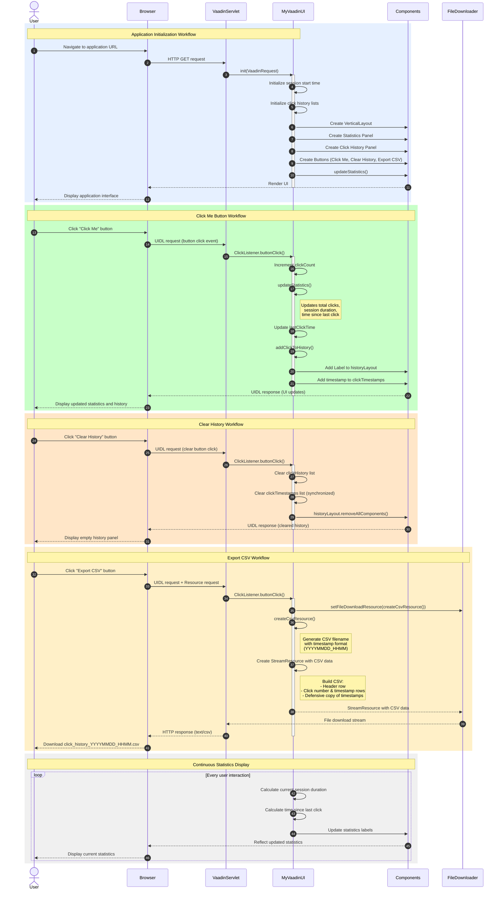

# VaadinSample User Workflows - Sequence Diagram

```mermaid
sequenceDiagram
    autonumber
    actor User
    participant Browser
    participant VaadinServlet
    participant MyVaadinUI
    participant Components
    participant FileDownloader
    
    %% Application Initialization
    rect rgb(230, 240, 255)
    Note over User,MyVaadinUI: Application Initialization Workflow
    User->>Browser: Navigate to application URL
    Browser->>VaadinServlet: HTTP GET request
    VaadinServlet->>MyVaadinUI: init(VaadinRequest)
    activate MyVaadinUI
    MyVaadinUI->>MyVaadinUI: Initialize session start time
    MyVaadinUI->>MyVaadinUI: Initialize click history lists
    MyVaadinUI->>Components: Create VerticalLayout
    MyVaadinUI->>Components: Create Statistics Panel
    MyVaadinUI->>Components: Create Click History Panel
    MyVaadinUI->>Components: Create Buttons (Click Me, Clear History, Export CSV)
    MyVaadinUI->>Components: updateStatistics()
    Components-->>Browser: Render UI
    deactivate MyVaadinUI
    Browser-->>User: Display application interface
    end
    
    %% Click Me Workflow
    rect rgb(200, 255, 200)
    Note over User,Components: Click Me Button Workflow
    User->>Browser: Click "Click Me" button
    Browser->>VaadinServlet: UIDL request (button click event)
    VaadinServlet->>MyVaadinUI: ClickListener.buttonClick()
    activate MyVaadinUI
    MyVaadinUI->>MyVaadinUI: Increment clickCount
    MyVaadinUI->>MyVaadinUI: updateStatistics()
    Note right of MyVaadinUI: Updates total clicks,<br/>session duration,<br/>time since last click
    MyVaadinUI->>MyVaadinUI: Update lastClickTime
    MyVaadinUI->>MyVaadinUI: addClickToHistory()
    MyVaadinUI->>Components: Add Label to historyLayout
    MyVaadinUI->>Components: Add timestamp to clickTimestamps
    Components-->>Browser: UIDL response (UI updates)
    deactivate MyVaadinUI
    Browser-->>User: Display updated statistics and history
    end
    
    %% Clear History Workflow
    rect rgb(255, 230, 200)
    Note over User,Components: Clear History Workflow
    User->>Browser: Click "Clear History" button
    Browser->>VaadinServlet: UIDL request (clear button click)
    VaadinServlet->>MyVaadinUI: ClickListener.buttonClick()
    activate MyVaadinUI
    MyVaadinUI->>MyVaadinUI: Clear clickHistory list
    MyVaadinUI->>MyVaadinUI: Clear clickTimestamps list (synchronized)
    MyVaadinUI->>Components: historyLayout.removeAllComponents()
    Components-->>Browser: UIDL response (cleared history)
    deactivate MyVaadinUI
    Browser-->>User: Display empty history panel
    end
    
    %% Export CSV Workflow
    rect rgb(255, 240, 200)
    Note over User,FileDownloader: Export CSV Workflow
    User->>Browser: Click "Export CSV" button
    Browser->>VaadinServlet: UIDL request + Resource request
    VaadinServlet->>MyVaadinUI: ClickListener.buttonClick()
    activate MyVaadinUI
    MyVaadinUI->>FileDownloader: setFileDownloadResource(createCsvResource())
    MyVaadinUI->>MyVaadinUI: createCsvResource()
    Note right of MyVaadinUI: Generate CSV filename<br/>with timestamp format<br/>(YYYYMMDD_HHMM)
    MyVaadinUI->>MyVaadinUI: Create StreamResource with CSV data
    Note right of MyVaadinUI: Build CSV:<br/>- Header row<br/>- Click number & timestamp rows<br/>- Defensive copy of timestamps
    MyVaadinUI-->>FileDownloader: StreamResource with CSV data
    FileDownloader-->>VaadinServlet: File download stream
    VaadinServlet-->>Browser: HTTP response (text/csv)
    deactivate MyVaadinUI
    Browser-->>User: Download click_history_YYYYMMDD_HHMM.csv
    end
    
    %% Background Statistics Update
    rect rgb(240, 240, 240)
    Note over User,Components: Continuous Statistics Display
    loop Every user interaction
        MyVaadinUI->>MyVaadinUI: Calculate current session duration
        MyVaadinUI->>MyVaadinUI: Calculate time since last click
        MyVaadinUI->>Components: Update statistics labels
        Components-->>Browser: Reflect updated statistics
        Browser-->>User: Display current statistics
    end
    end
```
